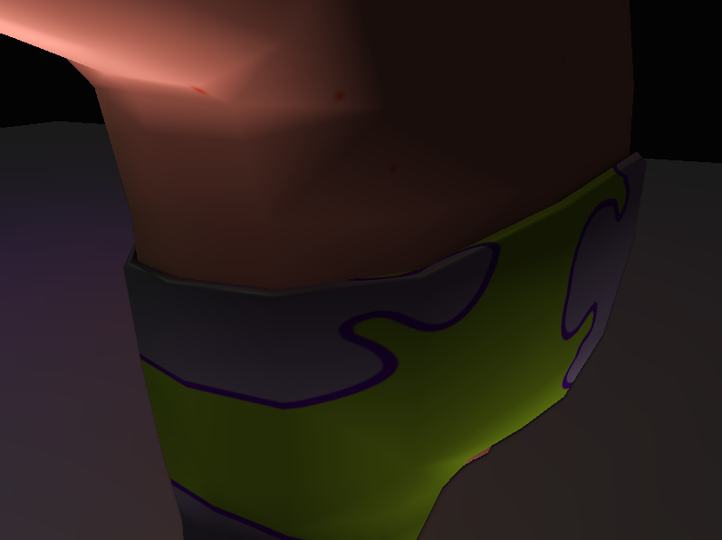

# AGP-P3 Engine

## Overview

This project is a Graphics Engine made in OpenGL, GLSL and C++. It implements various graphics techniques like Deferred Shading and SSAO.

## Members
- [Unai Diaz](https://github.com/unaidiaz)
- [Carlos Megia](https://github.com/Chuchocoronel)

## Controls
- WASD for movement.
- Right click while moving camera to rotate the camera.
- Left click while moving camera to orbit around (0, 0, 0).

## Techniques

### Deferred Shading
This technique stores the data of the scene in a framebuffer to calculate the lights and render all in one draw call.

Shader used: [Deferred shading](Engine/WorkingDir/quad.glsl)

### SSAO (Screen-Space Ambient Occlusion)
This is a post-processing technique that calculate the points in geometry that recieve less light than the others, creating an effect of better shadows.

Only rendering SSAO

SSAO on final render

Shader used: [SSAO shader](Engine/WorkingDir/quad.glsl)

---

Link to Repository [here](https://github.com/Chuchocoronel/AGP-P3)
